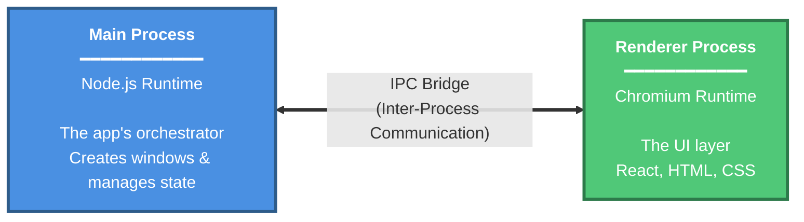

# Building an Offline-First Desktop App With Electron + Powersync

> Introduction about what electron is.

asdf

> Why offline first is a great choice

## Main process vs renderer process

### What's the difference?

If you’ve only lived in the typical world of web development, Electron’s Process Model can feel a bit jarring at first glance.
However, if you already think in "frontend vs backend", the split maps quite well:

- **Main process**: the app's *orchestrator* (Node.js)
  - Creates browser windows
  - Owns native OS integrations (like file system IO, tray notifications, and the auto-updater)
- **Renderer process**: the *UI runtime* (Chromium)
  - Where you write your UI code (React, Svelte, etc.)
  - Creates a separate one per each window/webview (think tabs)

These two process, much like a frontend and server, cannot *directly* talk to each other.
Rather, you must make an API for them to talk to each other with serialized data.
In Electron development, this is called an **IPC Bridge** (Inter-process communication)

The Electron documentation on their [Process Model](https://www.electronjs.org/docs/latest/tutorial/process-model) goes into greater depth on the subject.

### How does this affect me using PowerSync

Currently, PowerSync offers both

## Benchmarking the two processes

**Node Benchmark:**
- File: `benchmark-node-results-2025-10-31T03-04-02-997Z.json`
- Timestamp: 2025-10-31T03:04:02.997Z
- Engine: better-sqlite3
- SDK Version: 0.4.6/e15ce733

**Web Benchmark:**
- File: `benchmark-web-results-2025-10-31T02_42_02.226Z.json`

## Results

| Test | Description | Node (sec) | Web (sec) | Speedup |
|------|-------------|------------|-----------|---------|
| 1 | 1000 INSERTs | 0.457 | 2.497 | 5.47x |
| 2 | 25000 INSERTs in a transaction | 4.799 | 6.796 | 1.42x |
| 4 | 100 SELECTs without an index | 4.671 | 7.465 | 1.60x |
| 5 | 100 SELECTs on a string comparison | 5.764 | 8.170 | 1.42x |
| 7 | 5000 SELECTs using primary key | 5.676 | 7.526 | 1.33x |
| 8 | 1000 UPDATEs without an index | 11.589 | 21.390 | 1.85x |
| 9 | 25000 UPDATEs using primary key | 11.320 | 13.470 | 1.19x |
| 10 | 25000 text UPDATEs using primary key | 10.346 | 13.570 | 1.31x |
| 11 | INSERTs from a SELECT | 4.490 | 7.122 | 1.59x |
| 12 | DELETE without an index | 4.841 | 6.430 | 1.33x |
| 13 | DELETE using primary key | 4.522 | 7.465 | 1.65x |
| 14 | A big INSERT after a big DELETE | 13.583 | 13.309 | 0.98x |
| 15 | A big DELETE followed by many small INSERTs | 9.862 | 33.232 | 3.37x |
| 16 | Clear table | 4.924 | 5.366 | 1.09x |

## Summary

- **Total Node Time**: 96.846 seconds
- **Total Web Time**: 153.809 seconds
- **Overall Speedup**: 1.59x (Node is 37.0% faster)
- **Tests Compared**: 14
