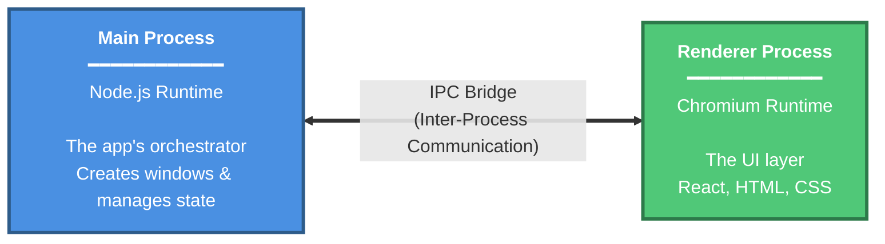

# Building an Offline-First Desktop App With Electron + Powersync

> Introduction about what electron is.

asdf

> Why offline first is a great choice

## Main process vs renderer process - why should I care?

If you’ve only lived in the typical world of web development, Electron’s Process Model can feel a bit jarring at first glance.
However, if you already think in "frontend vs backend", the split maps quite well:

- **Main process**: the app's *orchestrator* (Node.js)
  - Creates browser windows
  - Owns native OS integrations (like file system IO, tray notifications, and the auto-updater)
- **Renderer process**: the *UI runtime* (Chromium)
  - Where you write your UI code (React, Svelte, etc.)
  - Creates a separate one per each window/webview (think tabs)

These two process, much like a frontend and server, cannot *directly* talk to each other.
Rather, you must make an API for them to talk to each other with serialized data.
In Electron development, this is called an **IPC Bridge** (Inter-process communication)

The Electron documentation on their [Process Model](https://www.electronjs.org/docs/latest/tutorial/process-model) goes into greater depth on the subject.

